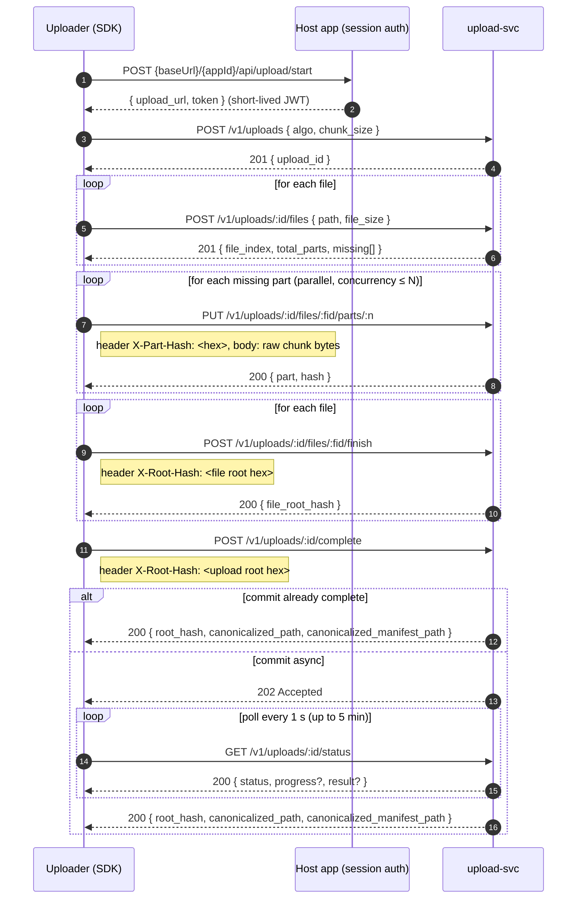

# `@bioturing-org/upload-svc`

This document describes how to use the `@bioturing-org/upload-svc` package
(the browser & Node TypeScript SDK for **upload-svc**) to perform chunked,
resumable, integrity-verified file and folder uploads.

> The package lives at [`packages/upload-svc-client`](../package.json). For the
> full reference, see the in-repo [`README.md`](../README.md). This guide
> focuses on practical, end-to-end usage patterns.

---

## Table of contents

1. [Overview](#overview)
2. [Install](#install)
3. [Construct an [`Uploader`]](#construct-an-uploader)
4. [Upload a single file](#upload-a-single-file)
5. [Upload a folder](#upload-a-folder)
   - [From a drag-and-drop `FileSystemEntry`](#from-a-drag-and-drop-filesystementry)
   - [From an `<input type="file" webkitdirectory>`](#from-an-input-typefile-webkitdirectory)
   - [From a Node.js directory](#from-a-nodejs-directory)
6. [Resume an interrupted upload](#resume-an-interrupted-upload)
7. [Abort an upload](#abort-an-upload)
8. [Cancel an upload server-side](#cancel-an-upload-server-side)
9. [Check which uploads are still alive](#check-which-uploads-are-still-alive)
10. [Validate a previously committed upload](#validate-a-previously-committed-upload)
11. [Use from Node.js](#use-from-nodejs)
12. [Errors and retry policy](#errors-and-retry-policy)
13. [Data structures](#data-structures)
14. [How it works under the hood](#how-it-works-under-the-hood)

---

## Overview

The SDK wraps the **upload-svc** REST API and makes uploads:

- **Chunked** — each file is split into fixed-size parts (default 1 MiB, tunable
  up to the server's 16 MiB max). Parts are uploaded as independent `PUT`s, so a
  dropped connection only costs one part.
- **Parallel** — parts are dispatched through a concurrency-limited pool
  ([`p-map`](https://www.npmjs.com/package/p-map) for fixed file lists,
  [`p-queue`](https://www.npmjs.com/package/p-queue) for streaming folders).
- **Integrity-verified** — every part is hashed client-side in WASM (the same
  `integrity` crate the server uses) and sent in an `X-Part-Hash` header; the
  server validates each chunk on arrival and recomputes the root hash at
  completion, rejecting with `409` on mismatch.
- **Resumable** — for single-file uploads the SDK persists its own part map in
  IndexedDB and skips already-uploaded parts on retry.
- **Tokenless from the consumer's view** — the SDK calls the hosting
  application's `POST {baseUrl}/{appId}/api/upload/start` endpoint to obtain a
  short-lived JWT before each upload, so the consumer never handles tokens.

### Upload flow



A single file is committed as an individual versioned file
(`report.pdf → report.v1.pdf`); a folder (multiple files sharing a common
top-level prefix) is committed as a versioned directory (`pkg/ → pkg.v1/`). The
server auto-detects which case applies from the file paths.

---

## Install

Install from GitHub Packages:

```bash
npm install @bioturing-org/upload-svc
# or
yarn add @bioturing-org/upload-svc
```

The SDK ships a dual ESM/CJS build (`dist/index.js` + `dist/index.cjs`) with
type declarations. It depends on the bundled `@bioturing/hash` WASM package,
`p-map`, and `p-queue`.

---

## Construct an `Uploader`

Construct an [`Uploader`](../src/uploader.ts:1224) once with shared config and
reuse it for every upload. Each `uploadFile()` / `uploadFolder()` call fetches
its own short-lived JWT, so the consumer never handles tokens directly.

```ts
import { Uploader } from '@bioturing-org/upload-svc';

const uploader = new Uploader({
  baseUrl: 'https://domain.bioturing.com', // application base URL, no trailing slash
  appId: 'spatialx',                       // embedded in the token-endpoint path
  algo: 'blake3',                          // 'blake3' | 'sha256' — must match the server
  chunkSize: 1024 * 1024,                  // part size in bytes (server max: 16 MiB)
  concurrency: 8,                          // in-flight part PUTs (default 8)
});
```

### [`UploaderConfig`](../src/types.ts:217) fields

| Field          | Type                                   | Notes                                                                              |
| -------------- | -------------------------------------- | ---------------------------------------------------------------------------------- |
| `baseUrl`      | `string`                               | Application base URL, no trailing slash. JWT fetched from `{baseUrl}/{appId}/api/upload/start`. |
| `appId`        | `string`                               | Application identifier embedded in the token-endpoint path.                        |
| `algo`         | `'blake3' \| 'sha256'`                 | Must match the server's expectation.                                              |
| `chunkSize`    | `number`                               | Part size in bytes (server max: 16 MiB).                                           |
| `concurrency?` | `number`                               | In-flight part `PUT`s. Defaults to `8`.                                            |
| `xAuthToken?`  | `string`                               | `xauth` session token. Omit in browser (cookie sent automatically); pass in Node. |
| `fetch?`       | `typeof fetch`                         | Optional `fetch` override (defaults to the global).                                |

---

## Upload a single file

[`uploadFile(file, opts?)`](../src/uploader.ts:1288) uses `file.name` as the
server-side path, so the server commits it as an individual file (file root
hash). Returns an [`UploadResult`](../src/types.ts:194).

```ts
const result = await uploader.uploadFile(fileInput.files[0]!, {
  onProgress: (e) => console.log(`${e.uploaded}/${e.total} bytes`),
});

console.log(result.rootHash, result.canonicalizedPath);
```

### [`UploadCallOptions`](../src/types.ts:247) fields

| Field             | Type                                 | Notes                                                    |
| ----------------- | ------------------------------------ | -------------------------------------------------------- |
| `signal?`         | `AbortSignal`                        | Aborts the upload (rejects with `AbortError`).           |
| `resume?`         | `{ storageKey: string }`             | Enables IndexedDB resume under `storageKey`.             |
| `onProgress?`     | `(e: ProgressEvent) => void`          | Byte-level progress: `{ uploaded, total }`.              |
| `onPartComplete?` | `(e: PartEvent) => void`             | Per-part completion: `{ fileIndex, part, bytes, hash }`. |
| `onUploadId?`     | `(uploadId: string) => void`         | Fired once per call with the server-assigned session id. |

---

## Upload a folder

[`uploadFolder(source, opts?, totalBytes?)`](../src/uploader.ts:1323) takes an
**async iterable** of [`FileSpec`](../src/types.ts:159) (`{ path, blob }`). It
creates the session immediately and registers + uploads each file as soon as
the iterable yields it, so uploads start while later files are still being read
from disk.

The yielded `path` must include the top-level folder name
(e.g. `pkg/a.bin`); the server strips the common prefix for the manifest.

### From a drag-and-drop `FileSystemEntry`

Use [`buildFolderStreamFromEntry(entry)`](../src/directory.ts:55) to lazily
walk one top-level dropped `FileSystemEntry` depth-first. It pre-computes the
folder's total size so progress is monotonic.

```ts
import { Uploader, buildFolderStreamFromEntry } from '@bioturing-org/upload-svc';

const [entry] = event.dataTransfer.items
  .map((item) => item.webkitGetAsEntry())
  .filter((e): e is FileSystemDirectoryEntry => e?.isDirectory ?? false);

const { source, totalBytes } = await buildFolderStreamFromEntry(entry);

const result = await uploader.uploadFolder(source, {
  onProgress: (e) => console.log(`${e.uploaded}/${e.total} bytes`),
}, totalBytes);
```

### From an `<input type="file" webkitdirectory>`

Use [`buildFolderStreamsFromInput(files)`](../src/directory.ts:126) to group
the `FileList` by top-level folder name. It returns a
`Map<folderName, { source, totalBytes }>`.

```ts
import { Uploader, buildFolderStreamsFromInput } from '@bioturing-org/upload-svc';

const streams = buildFolderStreamsFromInput(input.files);

for (const [folderName, { source, totalBytes }] of streams) {
  const result = await uploader.uploadFolder(source, {
    onProgress: (e) => setProgress(folderName, e.uploaded / e.total),
  }, totalBytes);
  console.log(folderName, result.rootHash);
}
```

### From a Node.js directory

Walk the directory lazily and yield `FileSpec` values. See the complete
runnable example at [`examples/node-upload/upload.mjs`](../../../examples/node-upload/upload.mjs).

```ts
import { readdir, readFile, stat } from 'fs/promises';
import { basename, join } from 'node:path';

async function nodeFolderStream(dirPath) {
  const topName = basename(dirPath);
  let totalBytes = 0;

  async function computeTotal(dir) {
    const entries = await readdir(dir, { withFileTypes: true });
    for (const entry of entries) {
      const child = join(dir, entry.name);
      if (entry.isDirectory()) await computeTotal(child);
      else if (entry.isFile()) totalBytes += (await stat(child)).size;
    }
  }

  async function* walk(dir, prefix) {
    const entries = await readdir(dir, { withFileTypes: true });
    for (const entry of entries) {
      const child = join(dir, entry.name);
      if (entry.isDirectory()) {
        yield* walk(child, `${prefix}${entry.name}/`);
      } else if (entry.isFile()) {
        const buffer = await readFile(child);
        yield { path: `${prefix}${entry.name}`, blob: new File([buffer], entry.name) };
      }
    }
  }

  await computeTotal(dirPath);
  return { source: walk(dirPath, `${topName}/`), totalBytes };
}

const { source, totalBytes } = await nodeFolderStream('./test-folder');
const result = await uploader.uploadFolder(source, {}, totalBytes);
```

---

## Resume an interrupted upload

Pass `resume: { storageKey }` to [`uploadFile()`](../src/uploader.ts:1288) to
persist the upload session (`upload_id` + part map) in IndexedDB under
`storageKey`. On a later call with the same `storageKey` and the same file, the
SDK:

1. Loads the persisted resume record.
2. Verifies the file list still matches (paths + sizes); discards if not.
3. Probes whether the server session is still alive by performing the next
   useful operation (register a file or upload a missing part). A `404`/`409`
   means the session was reaped/aborted/completed → it starts fresh.
4. Skips parts already confirmed uploaded and uploads only the missing ones.

```ts
const result = await uploader.uploadFile(file, {
  resume: { storageKey: 'my-large-file' },
  onProgress: (e) => setProgress(e.uploaded / e.total),
});
```

The `storageKey` is automatically namespaced with the uploader's `appId`, so
the same local file uploaded to different applications does not share a resume
record.

> **Note:** Resume is supported for `uploadFile()` only. `uploadFolder()`
> streams lazily and does not persist a resume record (the `resume` option is
> ignored for folder uploads).

Re-uploading any part is safe — `put_part` is idempotent.

---

## Abort an upload

Pass an `AbortSignal` via the `signal` option. Aborting rejects the promise
with an [`AbortError`](../src/errors.ts:70) (distinct from `UploadError` so
callers can tell cancellation apart from server failures). In-flight part
`PUT`s are cancelled and the resume record is left intact so the upload can be
resumed later.

```ts
const controller = new AbortController();
cancelButton.onclick = () => controller.abort();

try {
  await uploader.uploadFile(file, { signal: controller.signal });
} catch (err) {
  if (err instanceof AbortError) console.log('cancelled — resume later');
}
```

---

## Cancel an upload server-side

[`cancelUpload({ uploadId, key, signal })`](../src/uploader.ts:1379) calls
`DELETE /v1/uploads/:upload_id` to abort the session immediately and remove its
staging files. This is different from aborting via an `AbortSignal`, which only
stops the local upload loop and leaves the server session alive until the
reaper cleans it up.

Capture the `upload_id` via the `onUploadId` callback and pass the same
`storageKey` you used for resume so the local record is cleaned up too.

```ts
let uploadId: string;

await uploader.uploadFile(file, {
  resume: { storageKey: 'my-large-file' },
  onUploadId: (id) => { uploadId = id; },
});

// later, e.g. when the user explicitly cancels:
await uploader.cancelUpload({ uploadId, key: 'my-large-file' });
```

---

## Check which uploads are still alive

[`aliveUploads(uploadIds, signal?)`](../src/uploader.ts:1351) calls
`POST /v1/uploads/alive` with a list of `upload_ids` (max 1000 per request) and
returns the subset that still have a live session. Useful for filtering a
locally-stored list of resumable uploads down to ones that can still actually be
resumed, in one round trip.

```ts
const { alive_upload_ids } = await uploader.aliveUploads([
  '0192f0a1-…',
  '0192f0b2-…',
]);

console.log('resumable:', alive_upload_ids);
```

---

## Validate a previously committed upload

[`validate(path, signal?)`](../src/uploader.ts:1430) verifies a previously
uploaded file or directory against its manifest:

1. `GET /v1/manifest?path=…` — fetch the manifest written by a prior
   `uploadFile()` / `uploadFolder()` call.
2. `POST /v1/validate` — kick off a background manifest verification and get
   back a `validation_id`.
3. Poll `GET /v1/validate/{validation_id}/status` until the status is no
   longer `Running` and return the terminal response (`Verified` or `Failed`).

```ts
const status = await uploader.validate('report.v1.pdf');

if (status.status === 'Verified') {
  console.log('files verified:', status.progress?.files_verified);
} else {
  console.error('validation failed:', status.error);
}
```

For a directory upload, pass the top-level directory name as `path`.

---

## Use from Node.js

Node has no cookie jar, so pass `xAuthToken` — it's sent as a
`Cookie: xauth=…` header when fetching the JWT. Node 20+ has a global `File`
that extends `Blob`, so `uploadFile()` works directly.

```ts
import { readFile } from 'fs/promises';
import { Uploader } from '@bioturing-org/upload-svc';

const uploader = new Uploader({
  baseUrl: 'https://domain.bioturing.com',
  appId: 'spatialx',
  algo: 'blake3',
  chunkSize: 8 * 1024 * 1024, // 8 MiB
  xAuthToken: process.env.X_AUTH_TOKEN,
});

const buffer = await readFile('./report.pdf');
const result = await uploader.uploadFile(new File([buffer], 'report.pdf'), {
  onProgress: (e) => process.stdout.write(`\r${e.uploaded}/${e.total}`),
});
```

If you enable resume in Node, polyfill IndexedDB (Node has no native
IndexedDB):

```ts
if (process.env.RESUME_KEY) {
  await import('fake-indexeddb/auto');
}
```

See [`examples/node-upload/upload.mjs`](../../../examples/node-upload/upload.mjs)
for a complete runnable example supporting both single-file and folder modes.

---

## Errors and retry policy

All errors are exported from the package root.

| Class                                          | When raised                                                                                                                  |
| ---------------------------------------------- | ---------------------------------------------------------------------------------------------------------------------------- |
| [`UploadError`](../src/errors.ts:39)           | Any non-2xx server response. Carries `status`, `body`, `phase`, `context`.                                                   |
| [`AbortError`](../src/errors.ts:70)            | The caller aborted via `AbortSignal`.                                                                                        |
| [`HashMismatchError`](../src/errors.ts:82)     | `409` at `complete` — the server's recomputed root hash ≠ client's `X-Root-Hash`. Indicates corruption or session mismatch.  |
| [`PartUploadAggregateError`](../src/errors.ts:93) | One or more parts failed in the pool. Carries `.errors: UploadError[]`.                                                    |

`UploadError.phase` is one of `'create' | 'add-file' | 'part' | 'finish-file' |
'complete' | 'status' | 'abort'` (see [`UploadPhase`](../src/errors.ts:11)), so
callers can branch on which stage failed.

```ts
try {
  await uploader.uploadFile(file);
} catch (err) {
  if (err instanceof AbortError) {
    // user cancelled — resume later
  } else if (err instanceof HashMismatchError) {
    // corruption — abort, don't retry blindly
  } else if (err instanceof PartUploadAggregateError) {
    // some parts failed — inspect err.errors
  } else if (err instanceof UploadError) {
    // server error — check err.status / err.phase
  }
}
```

### Retry policy

Part uploads are retried automatically (up to 5 attempts, exponential backoff:
500 ms base, 30 s cap) on transient failures — network errors, `408`, `429`,
and `5xx`. Aborts and permanent `4xx` errors are not retried. `put_part` is
idempotent, so re-uploading a part after a timeout is safe.

---

## Data structures

### [`FileSpec`](../src/types.ts:159)

```ts
interface FileSpec {
  /** Relative path within the destination folder (no `..`, not absolute). */
  path: string;
  /** File content. `File` extends `Blob`, so an <input type=file> value works. */
  blob: Blob;
}
```

For directory uploads the `path` should include the top-level folder name
(e.g. `pkg/a.bin`); the server strips the common prefix for the manifest.

### [`UploadResult`](../src/types.ts:194)

```ts
interface UploadResult {
  /** Lowercase hex root hash of the assembled upload. */
  rootHash: string;
  /** Server's committed file or directory path (canonicalized). */
  canonicalizedPath: string;
  /** Server's manifest path (canonicalized). */
  canonicalizedManifestPath: string;
}
```

### [`ProgressEvent`](../src/types.ts:171) / [`PartEvent`](../src/types.ts:177)

```ts
interface ProgressEvent { uploaded: number; total: number; }
interface PartEvent { fileIndex: number; part: number; bytes: number; hash: string; }
```

### Server DTOs

The interfaces in [`types.ts`](../src/types.ts) mirror the upload-svc server's
JSON contracts **exactly** (snake_case, no runtime transform). See the server's
[`handlers/types.rs`](../../../crates/server/src/handlers/types.rs) for the
authoritative definitions.

---

## How it works under the hood

### Token acquisition

[`getUploadToken(opts)`](../src/token-source.ts:72) calls the application's
`POST {baseUrl}/{app}/api/upload/start` endpoint and returns
`{ uploadBaseUrl, token, claims }`. The JWT carries `dest_folder`, `iss`,
`jti`, `iat`, `exp` claims; the SDK decodes them client-side for inspection
only — the server verifies the signature on every request.

### HTTP client

[`UploadSvcClient`](../src/client.ts:54) is a thin, stateless fetch wrapper
over the upload-svc `/v1` endpoints. One method per server call; every request
carries the static JWT as `Authorization: Bearer <token>`.

### Hashing

All hashing is done in WASM via the bundled `@bioturing/hash` package, which
mirrors the server's `integrity` crate exactly. Functions return lowercase hex
(no `0x` prefix), matching the `X-Part-Hash` / `X-Root-Hash` wire format.

### Resume store

[`ResumeStore`](../src/resume.ts:87) is an IndexedDB-backed persistence (DB
`upload-svc-resume`, store `uploads`, keyed by the caller's `storageKey`). The
server's status endpoint reports commit-phase progress only; it does not expose
which individual parts the server has already received. Because parts can
arrive out-of-order, the client persists its own map of successfully uploaded
parts (keyed by server-assigned `file_index`) so it can skip them on resume and
recompute the root hash without re-hashing.
